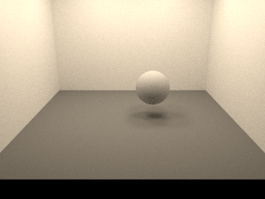
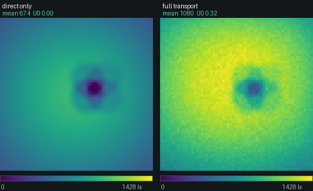
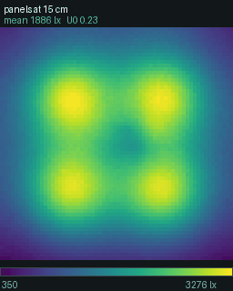
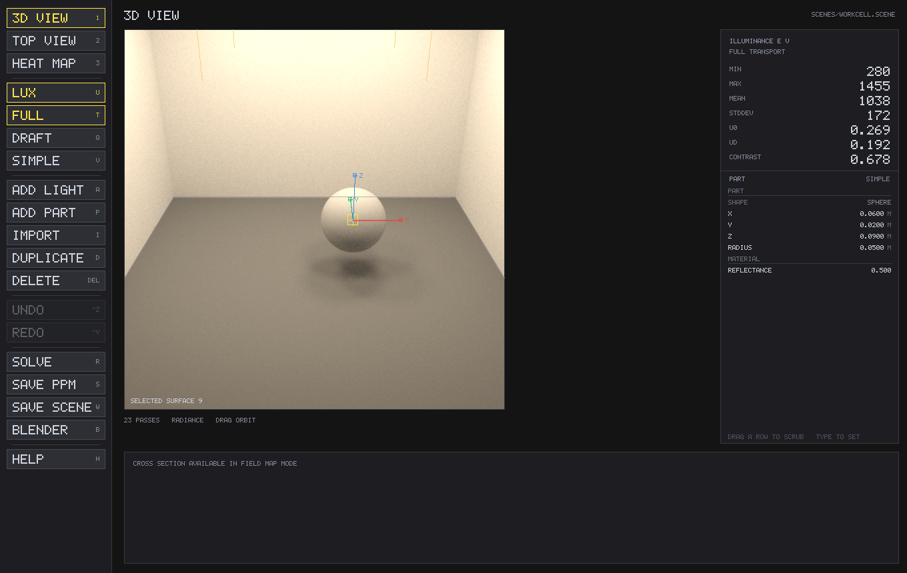

# Light-Simulation

A physically-based **spectral** ray tracer in C. Radiance is carried as 95 bins
across 360–830 nm; photometric quantities come from an exact
`∫ Φ(λ)·V(λ) dλ` against the CIE 1931 observer, so switching units re-projects
one stored spectrum rather than applying a correction factor.



```sh
make                                  # library, CLI and viewer
./lightsim-view scenes/workcell.scene
```

- **Measures, not renders.** Illuminance and irradiance over a grid, with
  min/max/mean, uniformity (U0, Ud) and Michelson contrast.
- **Spectral end to end.** Set 850 lm and change the colour temperature and the
  lumens stay put while the **watts** move — 4.6 W at 5000 K, 7.5 W at 2700 K.
- **Validated against closed forms**, not against how it looks. `make test` runs
  97 401 assertions, clean under ASan and UBSan.

<br clear="right">

## Why full transport

Direct light alone versus the full solution, same scene, same colour scale:



Interreflection off the white enclosure adds **60 % to the mean**. More to the
point, five grid points sit in the sphere's full shadow — under direct light
they receive *nothing*, so uniformity is 0.00. Bounced light puts 340 lx into
those same points and U0 becomes 0.32. A `cos(θ)/r²` model cannot see this.

## What a study looks like

Sweeping the mounting height of the 2×2 panel array, one shared colour scale:



Mean illuminance falls monotonically with height, as inverse-square demands —
1876 lx at 15 cm down to 1033 lx at 47 cm. Uniformity does not: it climbs to a
genuine optimum near 27 cm, then falls back as the part's shadow starts to set
the minimum. That dip survives a 25× increase in sample count, so it is the
scene, not the noise.

## The viewer



Click to select, drag the selection to move it along the surface under it, drag
elsewhere to orbit. The inspector on the right edits the selection: drag a row
to scrub, or type a number. Three tiers change what is *shown*, never what is
stored; the `LUX`/`WATT/M2` toggle changes which of the two equivalent numbers
you author in, at every tier.

| key | | key | | key |
|---|---|---|---|---|
| `1` 3D perspective | | `A` add light | | `U` lux ↔ W/m² |
| `2` orthographic plan | | `P` add part | | `T` full ↔ direct |
| `3` illuminance shading | | `D` duplicate | | `Q` draft ↔ fine |
| `F` drape field on geometry | | `Del` delete | | `V` tier |
| `Tab` cycle selection | | `⌘Z` `⌘Y` undo / redo | | `R` re-solve |
| `Esc` cancel → deselect → quit | | `S` `W` `B` save PPM / scene / Blender | | `H` every key, on screen |

Every command has a button as well, and every button shows its key on the
right, so the two can never disagree. Hovering a button explains what it does
and what it needs selected; `H` lists the lot, including the gestures that have
no button. What the viewer has to say — what was written, what was selected, an
import that was rescaled or refused — is said **on the canvas**, not only in
the terminal you may have launched it from.

`3` shades **every surface** by the illuminance arriving at it, not just the
measurement plane, so walls, parts and luminaire bodies are all measured.
Hovering reads the value under the cursor.

## Importing geometry

Blender and most CAD tools export OBJ or STL, and either can be dropped straight
into a scene:

```sh
./lightsim grid scene.scene --import bracket.obj
./lightsim grid scene.scene --import part.stl --import-scale 0.001 --import-at 0 0 0
```

In the viewer: **drag the file onto the window**, or press `I`. Imports go
through the same undo as any other edit, and the inspector's `SCALE` row
resizes an imported mesh afterwards — it grows about its own footprint centre
and base, so it neither slides sideways nor sinks through the floor.

| | OBJ | STL |
|---|---|---|
| geometry | yes | yes (ASCII and binary) |
| materials | `Kd` per `usemtl`, one mesh each | **none at all** — one default grey |
| units | metres, as Blender writes them | **unspecified** |

**STL has no units.** CAD tools almost universally mean millimetres; Blender
writes metres. Nothing in the file says which, so nothing can detect it — a part
imported at face value arrives 1000× too large. Rather than guess, files are
read as metres and the importer prints what it read:

```
assembly: 136 x 305 x 16 m   at (382 143 -6.1)..(518 449 10.1)
assembly: 0.136 x 0.306 x 0.0162 m  at (-0.068 -0.153 0)..(0.068 0.153 0.0162)
```

The position is reported as well as the size, because each catches a different
mistake. The size catches a units error. The **position** catches a part traced
perfectly somewhere the camera will never look: a CAD tool lays parts out on a
build plate, so an STL's coordinates sit a few hundred millimetres off the
origin, and a part imported as-authored into a room centred on the origin lands
outside the walls. `--import-at X Y Z` centres the footprint there and stands
the geometry on that height.

Refused rather than guessed: `Ke` emissive materials (a mesh emitter is found by
BSDF sampling but is not in the light list, so the measured grid would read
systematically low — use `light rect`), `Ks`/`Ns` speculars (there is no honest
map from a Phong exponent to measured spectral eta/kappa), and vertex normals (a
shading normal that disagrees with the geometric one breaks energy conservation
at grazing angles).

## CLI

```sh
./lightsim source mono 555                       # 683.0000 lm, exactly
./lightsim source blackbody 2856 --units photometric

./lightsim grid   scenes/workcell.scene --spp 256 --indirect 256 --depth 5 \
                  --out out/wc --blender out/wc.py
./lightsim render scenes/workcell.scene --spp 256 --depth 6 --out out/render.ppm
```

`grid` writes a CSV of every point, a false-colour PPM and a JSON summary.
`render` writes a tone-mapped PPM plus a PFM holding raw radiance in physical
units. `--indirect 0 --depth 0` gives direct light only, for comparison against
a closed-form model.

`--blender FILE.py` writes a script you run in Blender's Scripting tab. It
carries the geometry, real Blender lights with the **same radiant flux in
watts** the simulation used — Cycles reads area-light power as radiant flux — and
the measurement grid as a false-coloured mesh with the raw values kept in a
`Value` face attribute.

## Scene files

```
material floor lambert 0.20
material steel metal al 0.15                    # spectral complex IOR

quad   floor  0 0 0    0 0 1   0.3 0 0   0 0.3 0
sphere steel  0.06 0.02 0.09   0.05

light rect -0.12 -0.12 0.45  0.05 0 0  0 -0.05 0  lm 200 daylight 5000
light spot 0 0 0.4  0 0 -1  30 20  W 5 blackbody 3000

grid   -0.3 -0.3 0.001   0.6 0 0   0 0.6 0   64 64
camera 0 -0.72 0.30      0 0 0.06   42 480 360
```

Lights: `point`, `spot`, `rect`, `disk`, `sphere`, `sun`.
Spectra: `flat`, `blackbody <K>`, `daylight <CCT>`, `led <centre_nm> <fwhm_nm>`.
Flux may be given in `lm` or `W`; lumens are converted to watts once, at load,
so no photometric value is ever stored internally.

## Validation

| check | result |
|---|---|
| 1 W at 555 nm | 683.000 lm exactly |
| ∫V(λ)dλ | 106.857 nm |
| blackbody LER peak | 95.43 lm/W at 6628 K |
| illuminant A chromaticity | (0.44753, 0.40743) |
| uniform sphere ≡ point source of equal flux | 0.015 % apart |
| furnace, ρ = 0.9 → `L = Le/(1−ρ)` | 10.008 vs 10 |
| same box as 6 quads vs 12 triangles | agree to every printed digit |
| NEE vs BSDF-sampling vs MIS, same scene | agree to 0.5 % |

The furnace test matters most: it fails loudly on energy-conservation bugs,
missing cosine factors, wrong PDFs and bad Russian roulette — the errors that
are invisible in a picture that looks fine.

Every image in this README is a real run. `docs/` is generated by re-running the
simulator, and the false colour uses the same viridis table `viewer/draw.c` does.

## Licence

MIT. See `LICENSE`.
